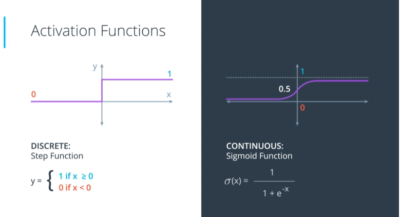
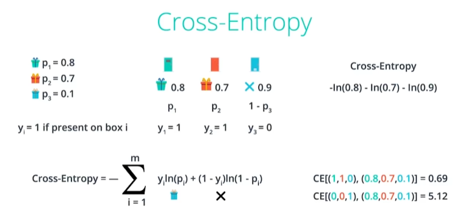
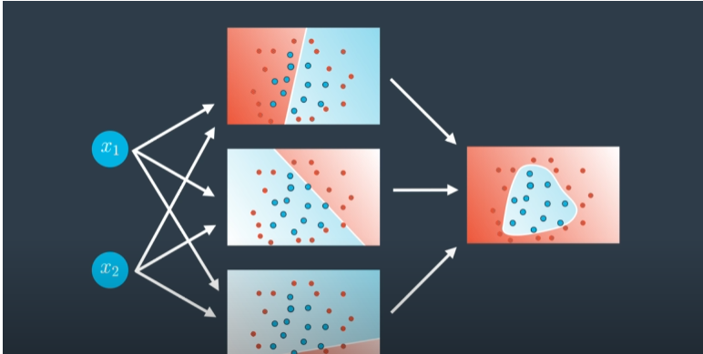
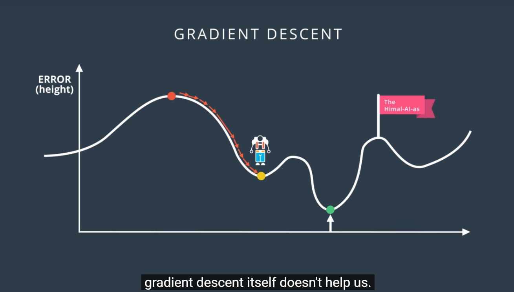

1. [[#Line Boundaries (and Higher Dimensions)|Line Boundaries (and Higher Dimensions)]]
1. [[#Perceptrons as Logical Operators|Perceptrons as Logical Operators]]
	1. [[#Exercise:|Exercise:]]
	1. [[#AND to OR|AND to OR]]
	1. [[#Not Perceptron|Not Perceptron]]
1. [[#Perceptron Trick|Perceptron Trick]]
1. [[#Perceptron Algorithm|Perceptron Algorithm]]
1. [[#Error Function|Error Function]]
1. [[#Discrete vs. Continuous Prediction|Discrete vs. Continuous Prediction]]
1. [[#Sigmoid Function|Sigmoid Function]]
1. [[#Softmax|Softmax]]
1. [[#One-Hot Encoding|One-Hot Encoding]]
1. [[#Maximum Likelihood|Maximum Likelihood]]
1. [[#Cross-Entropy|Cross-Entropy]]
1. [[#Gradient Descent Algorithm|Gradient Descent Algorithm]]
	1. [[#Comparing with Perceptron Trick|Comparing with Perceptron Trick]]
1. [[#Continuous Perceptrons|Continuous Perceptrons]]
1. [[#Neural Network Architecture|Neural Network Architecture]]
	1. [[#Multiple Layers|Multiple Layers]]
1. [[#Feedforward|Feedforward]]
1. [[#Backpropagation|Backpropagation]]
1. [[#Overfitting and Underfitting|Overfitting and Underfitting]]
1. [[#Regularization|Regularization]]
1. [[#Dropout|Dropout]]
1. [[#Local Minima|Local Minima]]
1. [[#Random Restart|Random Restart]]
1. [[#Vanishing Gradient|Vanishing Gradient]]

# Line Boundaries (and Higher Dimensions)


---
# Perceptrons as Logical Operators


## Exercise:
> What are the weights and bias for the AND perceptron?
> Set the weights (weight1, weight2) and bias (bias) to values that will
> correctly determine the AND operation as shown above. More than one set of values will work!

```python
import pandas as pd

# TODO: Set weight1, weight2, and bias
weight1 = 2
weight2 = 1
bias = -3


# DON'T CHANGE ANYTHING BELOW
# Inputs and outputs
test_inputs = [(0, 0), (0, 1), (1, 0), (1, 1)]
correct_outputs = [False, False, False, True]
outputs = []

# Generate and check output
for test_input, correct_output in zip(test_inputs, correct_outputs):
	linear_combination = weight1 * test_input[0] + weight2 * test_input[1] + bias
	output = int(linear_combination >= 0)
	is_correct_string = 'Yes' if output == correct_output else 'No'
	outputs.append([test_input[0], test_input[1], linear_combination, output, is_correct_string])

# Print output
num_wrong = len([output[4] for output in outputs if output[4] == 'No'])
output_frame = pd.DataFrame(outputs, columns=['Input 1', '  Input 2', '  Linear Combination', '  Activation Output', '  Is Correct'])
if not num_wrong:
	print('Nice!  You got it all correct.\n')
else:
	print('You got {} wrong.  Keep trying!\n'.format(num_wrong))
print(output_frame.to_string(index=False))

```

---
## AND to OR


## Not Perceptron
>Unlike the other perceptrons we looked at, the NOT operation only cares about one input. The operation returns a 0 if the input is 1 and a 1 if it's a 0. The other inputs to the perceptron are ignored.
>
> In this quiz, you'll set the weights (weight1, weight2) and bias bias to the values that calculate the NOT operation on the second input and ignores the first input.


```python
import pandas as pd

# TODO: Set weight1, weight2, and bias
weight1 = 0
weight2 = -1
bias = 0


# DON'T CHANGE ANYTHING BELOW
# Inputs and outputs
test_inputs = [(0, 0), (0, 1), (1, 0), (1, 1)]
correct_outputs = [True, False, True, False]
outputs = []

# Generate and check output
for test_input, correct_output in zip(test_inputs, correct_outputs):
	linear_combination = weight1 * test_input[0] + weight2 * test_input[1] + bias
	output = int(linear_combination >= 0)
	is_correct_string = 'Yes' if output == correct_output else 'No'
	outputs.append([test_input[0], test_input[1], linear_combination, output, is_correct_string])

# Print output
num_wrong = len([output[4] for output in outputs if output[4] == 'No'])
output_frame = pd.DataFrame(outputs, columns=['Input 1', '  Input 2', '  Linear Combination', '  Activation Output', '  Is Correct'])
if not num_wrong:
	print('Nice!  You got it all correct.\n')
else:
	print('You got {} wrong.  Keep trying!\n'.format(num_wrong))
print(output_frame.to_string(index=False))
```


---
# Perceptron Trick


---
# Perceptron Algorithm


---
# Error Function
!!! note Also See
[Intro to ANN](../../DeepLearning/Jose%20-%20Neural%20Nets%20and%20Deep%20Learning/Intro%20to%20ANN.md)
!!!
 

--
# Discrete vs. Continuous Prediction




---
# Sigmoid Function
sigmoid(x) = 1/(1+e-x)
```python
def sigmoid(x):
    return 1/(1+np.e**(-x))
```

---
# Softmax
!!! note 
Softmax is actually expotential. It turns every number into a positive number.
!!!


```python
import numpy as np

def softmax(L):
    expL = np.exp(L)
    sumExpL = sum(expL)
    result = []
    for i in expL:
        result.append(i*1.0/sumExpL)
    return result

```
---
# One-Hot Encoding


---
# Maximum Likelihood
- *Example in Video*
	- Two Models:
		- Model A = 80%
		- Model B = 55%
	- Which model is more accurate (Single Data Point)
		- Model A, if the student got accepted
		- Model B, if the student got rejected
	- When have multiple data points
		- The model that give higher probabliities to the events that happened to us
		


---
# Cross-Entropy


``` ad-note
title:                  IMPORTANT


 - Negative Input --> Null
 - Between 0 to 1 --> Negative
 - 1 --> 0
```

``` ad-note
A good model gives high probablity,
negative of the logarithm of large number is a small number
Cross-Entropy = SUM of all negative algorithm of [Probablity of Events]
```


- The **Error Function** is the **Cross-Entropy**
- **Conclusion** there's definitely a connection between probabilities and error functions, and it's called **Cross-Entropy**
- This concept is tremendously popular in many fields, including Machine Learning.

- How likely is it those events happen based on the probablities
- Very likely --> **Small** *cross entropy*
- Unlikely --> **Large** *cross entropy*




# Gradient Descent Algorithm


## Comparing with Perceptron Trick

!!! note Difference
In the old *perceptrone algorithm*, the $\hat{y}$ can only take in 0 or 1 
In the new *gradient descent algorithm*, the $\hat{y}$ can only take in any value between 0 and 1.
!!!


!!! note Difference
For $x_i$ correctly classified, Gradient Descent Algorihm will change the weight and bias to move the line further.
For perceptron algorithm, no action is taken.
!!!

# Continuous Perceptrons


# Neural Network Architecture


!!! note What if we want to have more weights from certain model(s)
See above. 
This is the heart of how neural network get build
Linear combination of the two models (with weights and bias)
Video: https://youtu.be/Boy3zHVrWB4
!!!


- 7x the first model and 5x the second model


!!! note
The weight on the left tell us what the equations the linear models have.
The weights on the right, tell us what are the weghts of the two models to obtain the curve non-linear model 
!!!


## Multiple Layers

!!! note
When we have $n$ nodes in the input layers, the outlput layer bounds a non-linear region in 3 spaces.

!!!


**highly non-linear map ashte result**

# Feedforward


# Backpropagation
<iframe src="https://youtu.be/1SmY3TZTyUk]" height=400 width=600 align="center"></iframe>

Now, we're ready to get our hands into training a neural network. For this, we'll use the method known as backpropagation. In a nutshell, backpropagation will consist of:

- Doing a feedforward operation.
- Comparing the output of the model with the desired output.
- Calculating the error.
- Running the feedforward operation backwards (backpropagation) to spread the error to each of the weights.
- Use this to update the weights, and get a better model.
- Continue this until we have a model that is good.
---
> Single Layer

   ![[Pasted image 20210812233545.png]]
 > Multi Layers


  ![[Pasted image 20210812233614.png]]
  ![[Pasted image 20210812233719.png]]
## Math in Backpropagation
![[Pasted image 20210812234759.png]]
```ad-note
title: Gradient of The Error
is simply the vector formed by all the partial derivates of the error function with respect to the weights $w1$ up to $wn$ and the bias $b$.
```
![[Pasted image 20210812235033.png]]
![[Pasted image 20210812235113.png]]
## Chain Rule
For calculating derivatives
![[Pasted image 20210812235343.png]]
![[Pasted image 20210812235401.png]]
![[Pasted image 20210812235606.png]]
![[Pasted image 20210812235728.png]]

![[Pasted image 20210812235834.png]]

# Overfitting and Underfitting
https://youtu.be/xj4PlXMsN-Y


!!! warning Super useful
Underfitting - Error due to **Bias**
Overfitting - Error due to **Variance**
!!!


- Then use certain techniques to prevent overfitting

# Regularization
	#todo
	
# Dropout


!!! note How it's actually done
randomly switched off in e-poch
!!!


# Local Minima


# Random Restart


# Vanishing Gradient

!!! note 
If we calculate the derivatives on either way left and right, it's almost zero
!!!

# Other Activation Functions
**Correction**: For the plots of _tanh_() and _relu_() in the first half of the video, the origin should be labeled with a value _y_ = 0, not 0.5.
![[Pasted image 20210812235939.png]]
![[Pasted image 20210813000057.png]]

# Batch vs. Stochastic Gradient Descent
![[Pasted image 20210813000209.png]]
> For every step (epoch), the forward and backward propagation is done for each of the data point. Expensive computation.

![[Pasted image 20210813000549.png]]
> In the example, 26 points are divided into 4 batches of 6 data points.
> With SDC, it takes 4 steps compared to 1 step if used normal Gradient Descent

![[Pasted image 20210813000727.png]]

# Learning Rate Decay
![[Pasted image 20210813001049.png]]
# Momentum
```ad-note
In practice, this usually works very well
```
![[Pasted image 20210813001219.png]]