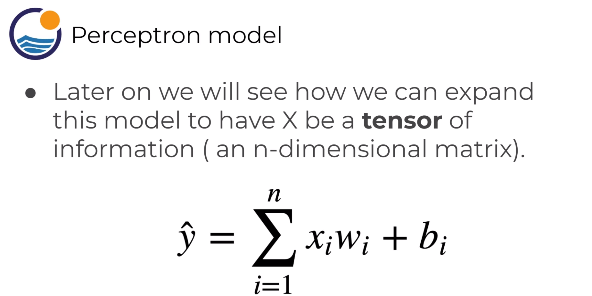
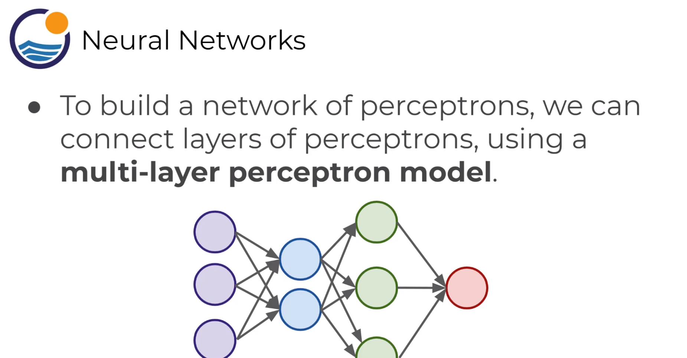
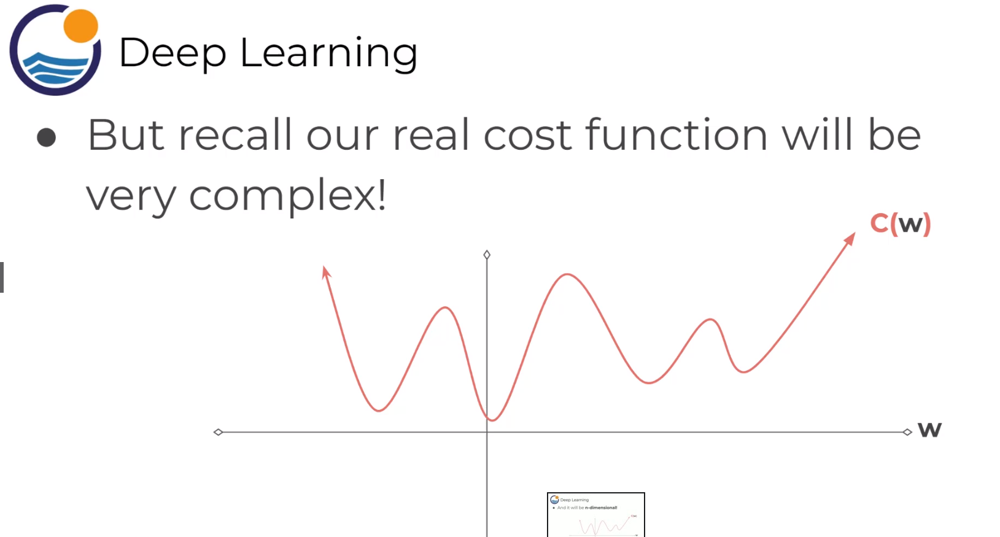
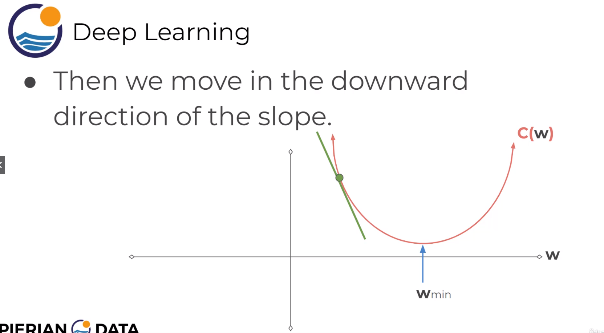
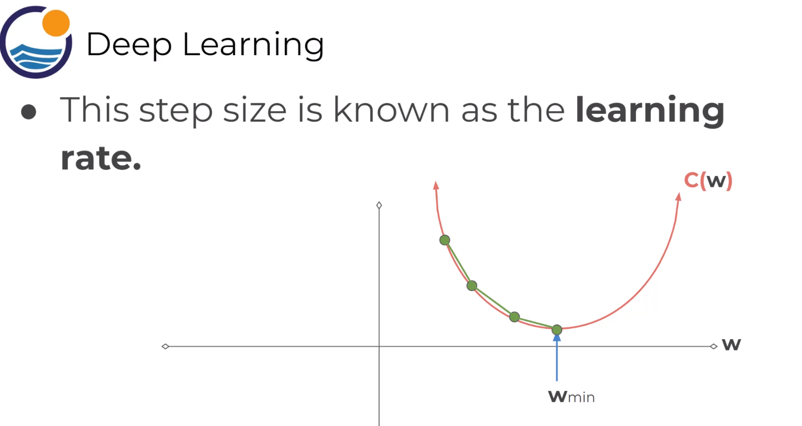
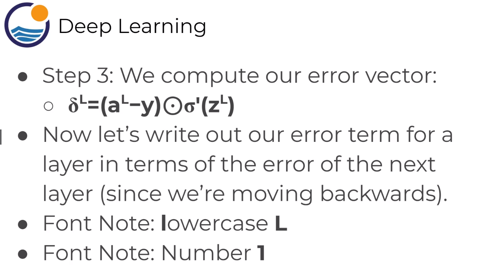

Intro to ANN

# Overview

# Perceptron Model

# Neural Network

!!! info Universal Approximation Theorem
Find out more on Wiki for Slide Above
!!!

# Activation Function
## Step Function

---
## Sigmoid Function

---
## Hyperbolic Tangent

---
## Rectified Linear Unit (ReLU)

!!! note Often Default to ReLU
Other functions https://en.wikipedia.org/wiki/Activation_function
!!!

---
## Multi-Class Classification Considerations

---
### Mutually Exclusive Classes

---

# Cost Functions & Gradient Descent
## Cost Function
- May also known as Error Functions

	- $y(x)$ = actual output
	- $a^L(x)$ = activation output of Last layer
	- Squaring the difference to punishes large errors

  
  
  
  
  
  
 -  Students of calculus know we could taek a derivative and solve for 0.
  
  - **and also n-dimnensional**
  ---
  ## Gradient Descent
  
  
  
  
  
  
  
  
  
  # Backward Propogation
  ## Theory / Math
  
  
  
  

!!! warning Partial Derivative
!!!

---
## Actual Learning (Recap the Whole Process)

# TensorFlow and Keras
